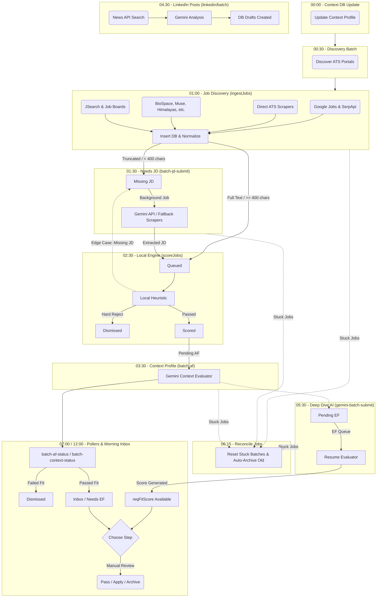

# Career Dashboard Job Pipeline

This diagram maps exactly how a job travels from initial discovery all the way through the various AI and local evaluations to your Inbox, updated with the scheduled cron timeline.

